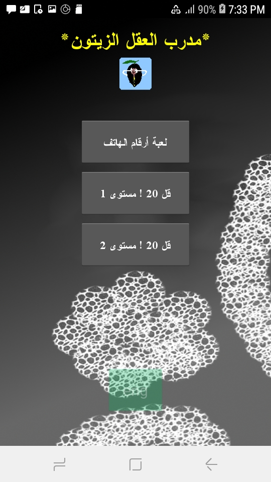
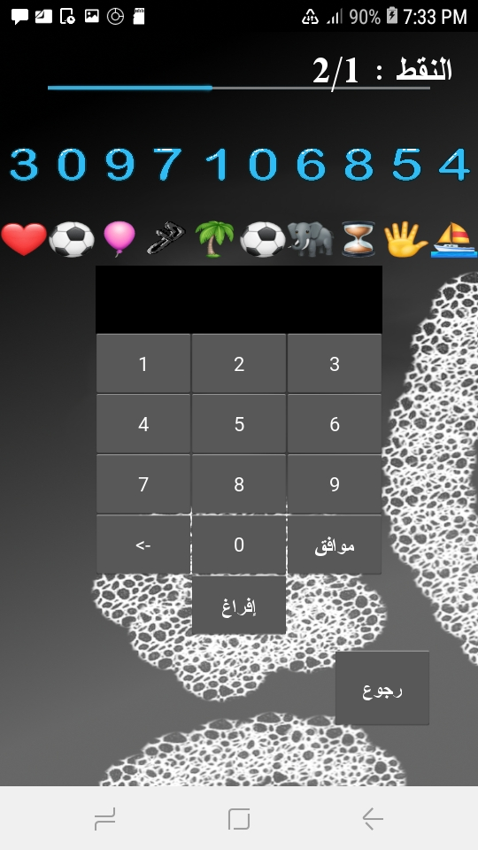
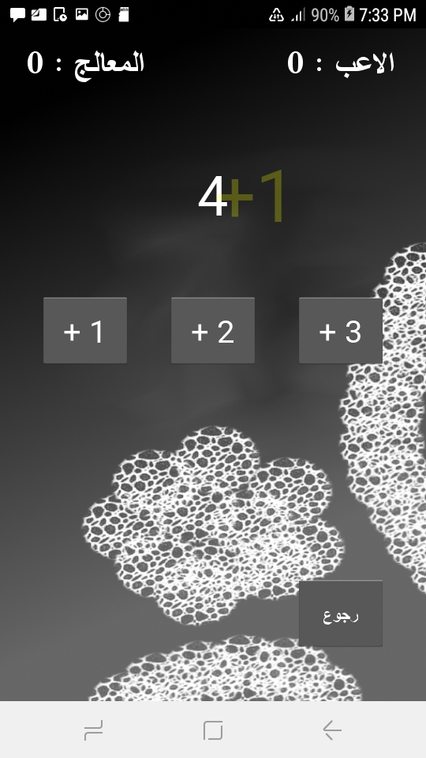

# zaitoun-mind-trainer 
app to increase memorisation's skills for phone numbers, and to play vs CPU "who will say 20" using maths !

## حاول حفظ الرقم في الوقت المتاح (30 ثانية) ثم اكتب الجواب, الصور الممثلة للرقم ستساعدك 

## try to memorize the number within the given time (30 seconds) then write it down, mnemonics will help you
 

## إلعب مع المعالج وحاول أن تصل إلى 20 أولا, سأدعكك لتعرف كيف, بالمرح

## play with CPU, try to reach 20 first, i let you to guess how, and have fun

#### Get zaitoun mind trainer v1.0.apk (13,2 M) : [download here](https://github.com/monsef-alahem/zaitoun-mind-trainer/raw/master/zaitoun_mind_trainer-v1.0-.apk)

## utilities used

Python 3.7 + Kivy 1.9.0 : language and framework used for coding

Piskel 0.14.0 : for drawing icons in pixelart style

Gimp 2.10 : for drawing backgrounds

Buildozer 0.39 : for apk and ios build, only for linux

## build

### run app

install kivy if not done yet

run :

main.py with python 3

$ python main.py

### mobile packaging

install buildozer if not done yet
this step is only for linux
in the app dir run:

buildozer -v android debug

## what next?

???

## contributions are welcome

for more informations or any suggestion, contribution and others, contact me in m.alahem09@gmail.com
